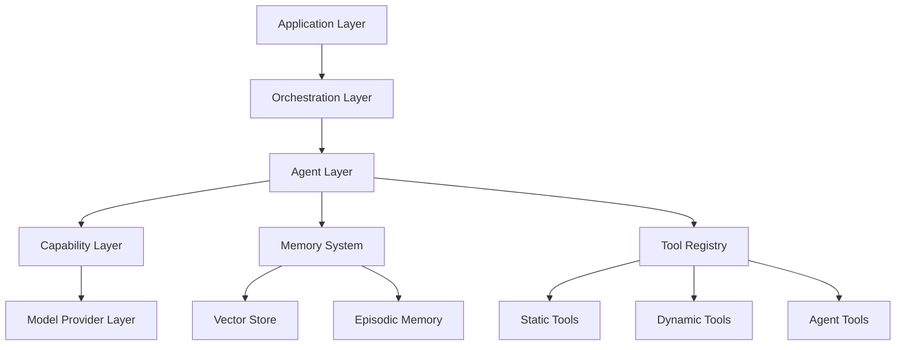

# Architecture Overview

## Vision

This framework is designed to be AGI-ready, meaning it abstracts over specific model capabilities and can seamlessly adapt as AI systems become more capable. The architecture prioritizes flexibility, composability, and graceful evolution.

## Core Principles

### 1. Capability-Based Abstraction

We architect around **what systems can do** rather than **which models we use**. This means:

- Interfaces defined by capabilities (reasoning, vision, tool-use, memory)
- Model providers are swappable implementations
- Capability detection and graceful degradation built-in

### 2. Composable Agent Architecture

Systems are built from composable agents that can:

- Operate independently or in coordination
- Delegate tasks to specialized sub-agents
- Self-correct through iterative refinement
- Maintain context across complex operations

### 3. Dynamic Reasoning Chains

Rather than fixed workflows, we support:

- Runtime workflow generation
- Multi-step reasoning with backtracking
- Parallel exploration of solution paths
- Adaptive strategy selection

## System Architecture



## Key Components

### Orchestration Layer

**Purpose**: Manages complex multi-agent workflows and task decomposition

**Responsibilities**:

- Task planning and decomposition
- Agent coordination and communication
- Resource allocation
- Workflow state management

**Key Classes**:

- `Orchestrator`: Main workflow coordinator
- `TaskPlanner`: Breaks down complex goals
- `AgentCoordinator`: Manages agent interactions

### Agent Layer

**Purpose**: Encapsulates reasoning and action-taking capabilities

**Agent Types**:

- `ReasoningAgent`: General-purpose problem solving
- `SpecializedAgent`: Domain-specific expertise
- `MetaAgent`: Plans and delegates to other agents
- `ReflectiveAgent`: Reviews and improves outputs

**Key Interfaces**:

```typescript
interface Agent {
  capabilities: Capability[];
  execute(task: Task, context: Context): Promise<Result>;
  reflect(result: Result): Promise<Improvement>;
}
```

### Capability Layer

**Purpose**: Abstracts model capabilities from specific implementations

**Core Capabilities**:

- `Reasoning`: Multi-step problem solving
- `Vision`: Image understanding
- `ToolUse`: Function calling and execution
- `LongContext`: Extended context window operations
- `Structured`: JSON/typed output generation

**Design Pattern**:

```javascript
/**
 * @typedef {Object} Capability
 * @property {string} name
 * @property {string} version
 * @property {Function} supports - Check if meets requirement
 */

class Capability {
  constructor(name, version) {
    this.name = name;
    this.version = version;
  }
  
  supports(requirement) {
    // Check if this capability meets the requirement
    return requirement.name === this.name;
  }
}

class CapabilityProvider {
  constructor() {
    this.capabilities = new Map();
  }
  
  getCapability(type) {
    return this.capabilities.get(type);
  }
  
  registerCapability(capability) {
    this.capabilities.set(capability.name, capability);
  }
}
```

### Memory System

**Purpose**: Maintains context and learned information across sessions

**Components**:

- `ShortTermMemory`: Current conversation/task context
- `EpisodicMemory`: Historical task executions
- `SemanticMemory`: Learned facts and concepts
- `ProceduralMemory`: Successful strategies and patterns

**Storage Strategy**:

- Vector embeddings for semantic search
- Structured storage for episodic retrieval
- Intelligent summarization for compression

### Tool Registry

**Purpose**: Manages available tools and their dynamic composition

**Tool Types**:

- **Static Tools**: Predefined functions (API calls, calculations)
- **Dynamic Tools**: Runtime-generated tools
- **Agent Tools**: Other agents as callable tools
- **Composite Tools**: Tools built from other tools

**Registry Interface**:

```javascript
class ToolRegistry {
  constructor() {
    this.tools = new Map();
  }
  
  /**
   * Register a new tool
   * @param {Tool} tool
   */
  register(tool) {
    this.tools.set(tool.name, tool);
  }
  
  /**
   * Discover tools matching requirement
   * @param {string} requirement
   * @returns {Array<Tool>}
   */
  discover(requirement) {
    return Array.from(this.tools.values())
      .filter(tool => tool.description.includes(requirement));
  }
  
  /**
   * Compose multiple tools
   * @param {Array<Tool>} tools
   * @returns {CompositeTool}
   */
  compose(tools) {
    return new CompositeTool(tools);
  }
  
  /**
   * Generate tool from specification
   * @param {Object} specification
   * @returns {Tool}
   */
  async generateTool(specification) {
    // Use AI to generate tool implementation
    // based on specification
  }
}
```

## Model Provider Layer

**Purpose**: Abstracts specific AI model APIs

**Provider Interface**:

```javascript
class ModelProvider {
  constructor(config) {
    this.name = config.name;
    this.capabilities = new Set(config.capabilities);
  }
  
  async complete(prompt, options) {
    throw new Error('Must implement complete()');
  }
  
  async *stream(prompt, options) {
    throw new Error('Must implement stream()');
  }
  
  estimateCost(prompt) {
    throw new Error('Must implement estimateCost()');
  }
  
  getContextWindow() {
    throw new Error('Must implement getContextWindow()');
  }
}
```

**Supported Providers** (initially):

- Anthropic (Claude)
- OpenAI (GPT-4)
- Local models (via Ollama)
- Custom providers

## Data Flow

### Typical Request Flow

1. Application submits high-level goal
2. Orchestrator decomposes into tasks
3. Tasks routed to appropriate agents based on capabilities
4. Agents leverage memory and tools
5. Results aggregated and refined
6. Memory updated with learnings

### Context Management

- **Token Budget Tracking**: Monitor and optimize context usage
- **Intelligent Summarization**: Compress older context
- **Retrieval Augmentation**: Pull in relevant context on demand
- **Context Partitioning**: Separate task, domain, and conversation context

## Extensibility Points

### Adding New Capabilities

1. Define capability interface
2. Implement provider-specific versions
3. Update capability detection
4. Add to agent configuration

Example:

```javascript
class VisionCapability extends Capability {
  constructor() {
    super('vision', '1.0');
  }
  
  supports(requirement) {
    return requirement.type === 'image-understanding';
  }
}
```

### Custom Agent Types

Extend `BaseAgent` and implement:

- `plan()`: How the agent approaches tasks
- `execute()`: Core execution logic
- `reflect()`: Self-improvement mechanism

Example:

```javascript
class ReasoningAgent extends BaseAgent {
  async plan(task) {
    // Break down task into steps
    return await this.decompose(task);
  }
  
  async execute(task, context) {
    const plan = await this.plan(task);
    const results = [];
    
    for (const step of plan) {
      const result = await this.executeStep(step, context);
      results.push(result);
    }
    
    return this.synthesize(results);
  }
  
  async reflect(result) {
    // Evaluate quality and suggest improvements
    return await this.evaluate(result);
  }
}
```

### Tool Integration

Register new tools via:

```javascript
toolRegistry.register({
  name: "custom_tool",
  description: "What it does",
  parameters: schema,
  execute: async (params) => { 
    // Implementation
    return result;
  }
});

// Or with a class
class CustomTool {
  constructor() {
    this.name = 'custom_tool';
    this.description = 'What it does';
  }
  
  async execute(params) {
    // Implementation
    return result;
  }
}

toolRegistry.register(new CustomTool());
```

## Design Decisions

### Why capability-based abstraction?

Models evolve rapidly. By focusing on capabilities rather than specific models, we can:

- Swap providers without refactoring application logic
- Automatically leverage new model features
- Support multiple providers simultaneously
- Test with cheaper models, deploy with best models

### Why composable agents?

Complex tasks require specialization and coordination. Composable agents enable:

- Separation of concerns
- Reusable specialist agents
- Emergent problem-solving through coordination
- Easy testing of individual components

### Why dynamic workflows?

Fixed workflows break as tasks grow complex. Dynamic workflows allow:

- AGI-like adaptive problem solving
- Handling of novel situations
- Self-correction and iteration
- Emergent strategies

## Performance Considerations

- **Caching**: Aggressive caching of embeddings, tool results, and common queries
- **Parallelization**: Run independent sub-tasks concurrently
- **Streaming**: Stream responses for better UX
- **Cost Optimization**: Route to cheapest capable model

## Security & Safety

- **Prompt Injection Defense**: Sanitize inputs, use structured outputs
- **Tool Access Control**: Permissions system for sensitive tools
- **Output Validation**: Verify agent outputs before execution
- **Audit Logging**: Track all agent decisions and tool uses

## Future Considerations

As we move toward AGI, this architecture should support:

- **Self-improvement**: Agents that refine their own prompts and strategies
- **Meta-learning**: Learning across tasks to improve performance
- **Multi-modal reasoning**: Seamless integration of vision, audio, etc.
- **Autonomous research**: Agents that can explore and learn independently
- **Human-AI collaboration**: Natural handoff between human and AI work

## Next Steps

1. Implement core capability abstractions
2. Build basic orchestration layer
3. Create initial agent types
4. Develop memory system
5. Integrate first model providers
6. Build evaluation framework

---

**Last Updated**: December 23, 2025  
**Owner**: Funnelists LLC  
**Status**: Living Document
